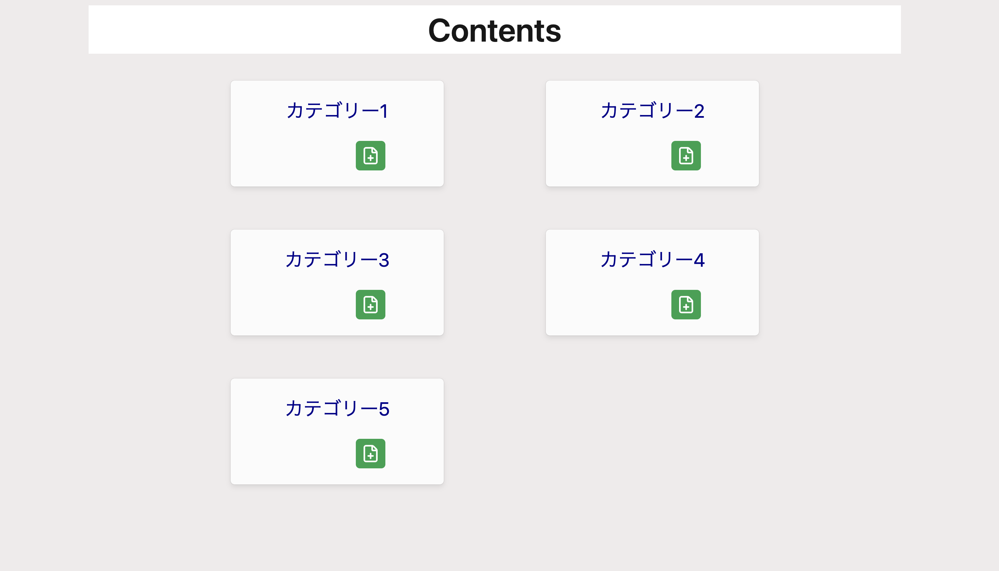
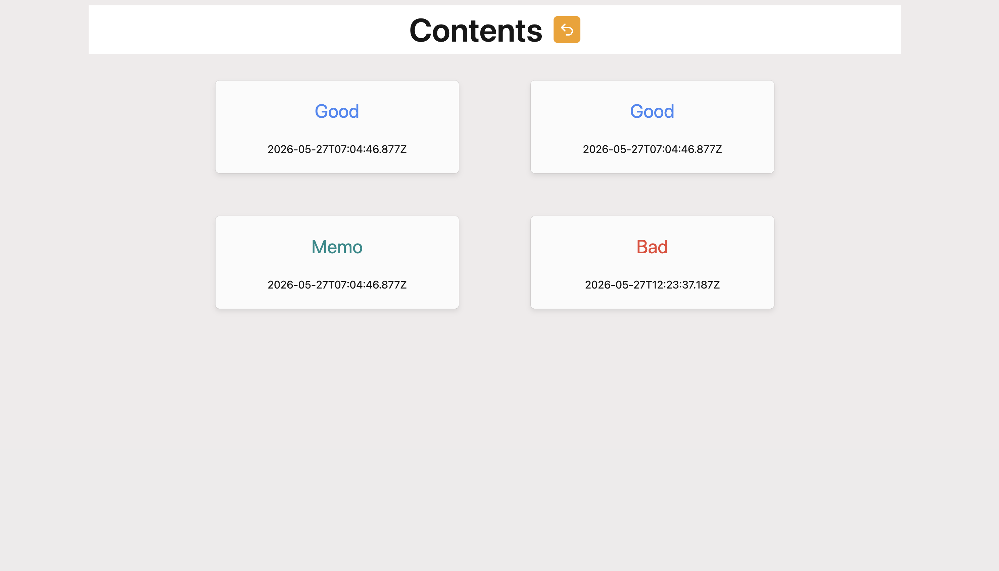
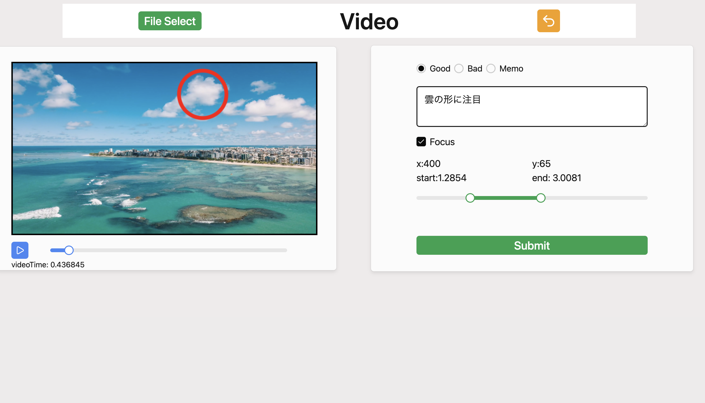
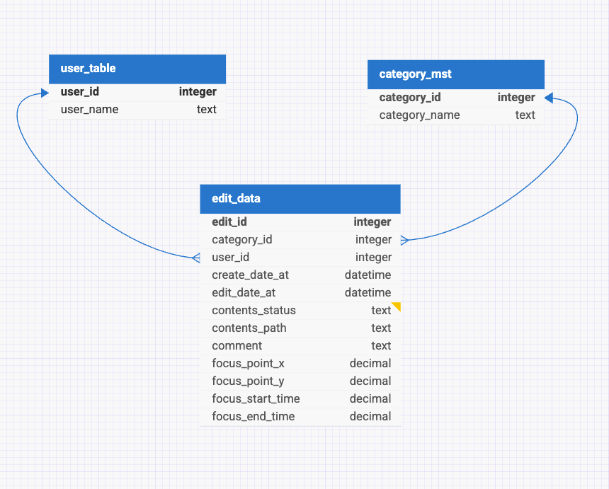

# 動画メモアプリ

## 背景

- 他の人と、同じ動画を見ていても、違うところを見ていたってことはありませんか？
- 自分の思っている事と、相手の思っている事がズレてしまう事がしばしば...

## 目的

- 「簡単」に動画内で認識を合わせたい部分を共有できるようにする

## アプリの概要

このアプリでは下記の機能を持っています

- 動画に目印をつけたり、メモを残すなど簡易的な編集が可能です
- カテゴリー別に動画を記録していくことで、振り返りもしやすいのが特徴
- クラウドサーバー(AWS S3)を使用する事により、他ユーザーとも共有できます
- 操作方法もいたってシンプルなものとなっています

## アプリのプレビュー

| カテゴリー　                 | 項目 　                      | 動画 　                   |
| ---------------------------- | ---------------------------- | ------------------------- |
|  |  |  |

## 事前準備

依存関係のインストール

/btc-fullstackの階層で下記を実施する

```sh
npm install
```

次に、/btc-fullstack/frontの階層へ移動し下記を実施する

```sh
npm install
```

> [!TIP]
> `/btc-fullstack` の階層ではバックエンドを、　`/btc-fullstack/front`の階層ではフロントエンドのパッケージ類をインストールしています

## データベースのスキーマ

下記のようになっています



```txt
user_table {
	user_id integer pk increments unique
	user_name text
}

category_mst {
	category_id integer pk increments unique
	category_name text
}

edit_data {
	edit_id integer pk increments unique
	category_id integer *> category_mst.category_id
	user_id integer *> user_table.user_id
	create_date_at datetime
	edit_date_at datetime null
	contents_status text
	contents_path text
	comment text
	focus_point_x decimal
	focus_point_y decimal
	focus_start_time decimal
	focus_end_time decimal
}

Ref: edit_data.category_id > category_mst.category_id [delete: cascade]
Ref: edit_data.user_id > user_table.user_id [delete: cascade]
```

上記で表現している関係性の記号は下記となります。

| 記号 | 関係性 |
| ---- | ------ |
| pk   | 主キー |
| \*>  | 多対一 |

データベースの構築

```sh
psql
CREATE DATABASE btc_fullstack;
\q
```

- .env ファイルの作成（ご自身のデータベース接続情報に応じて記述してください）

マイグレーションとシード
/btc-fullstackの階層で下記を実施する

```sh
npm run db:migrate
npm run db:seed
```

データベースの確認

```sh
psql -d btc_fullstack
\dt
SELECT * FROM edit_data;
\q
```

テストの実行

```sh
npm run test
```

アプリの起動

/btc-fullstackの階層、/btc-fullstack/frontの階層
それぞれで下記を実施する

```sh
npm run dev
```

## 将来の構想

- AI技術発展に伴う、フィジカルAIの拡大が予想される
- その為、このツールで蓄積したデータをAIが学習できるようなツールに進化をさせていく
- 人と人の認識共有を経て、人とAIの認識共有のツールへと拡張
- あくまでも「人を中心」とする人ファーストな設計
